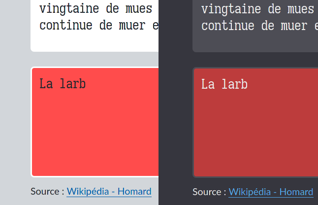
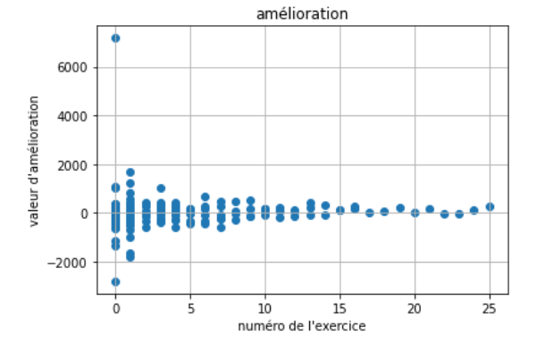
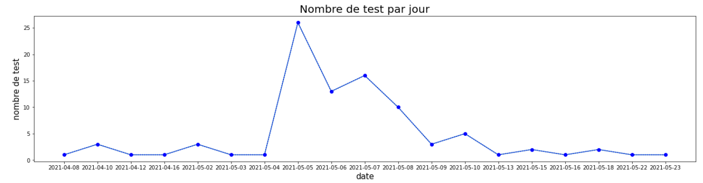
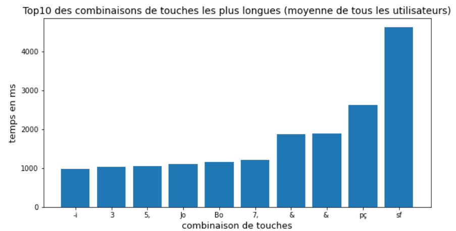
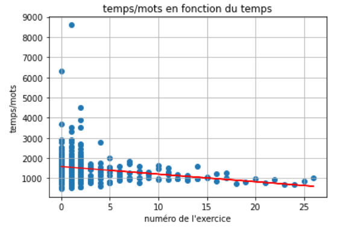

# 1 - Présentation du projet

## 1.1 - Contexte

Dans le cadre du développemment de ce projet, nous étions quatre étudiants ; trois en spécialité Informatique et un en spécialité Science des Données. Il a donc fallu trouver et proposer un projet dont le développement ferait appel à ces deux spécialités.

En octobre 2020, soit bien en amont des annonces des sujets, nous avions déjà défini une idée globale de ce que nous voulions développer : une plateforme de tests de dactylographie avec une personnalisation des exercices proposés en fonction de l'utilisateur.

L'application Ptero Dactyl est donc notre réponse à ce sujet qui comporte à la fois des problématiques liées au développement logiciel et à l'analyse de données. Pour concrétiser cette idée nous avons défini deux phases de développement : une première phase d'étude dans laquelle nous proposons d'effectuer des tests à un panel d'utilisateurs selon un protocole mis en place par notre spécialiste en SD (voir le chapitre sur l'analyse des données). La seconde phase consiste au déploiement de l'application finale qui utilise ce que nous avons appris sur les habitudes des utilisateurs pour proposer une expérience personnalisée.

Malheureusement, et par manque de temps à consacrer à ce projet, nous n'avons pas pu mettre en pratique la deuxième phase. Ce document ne décrit donc que ce que nous avons mis en place pour mener à bien la première phase et un aperçu des fonctionnalités que nous aurions voulu implémenter lors de la seconde phase.

## 1.2 - Choix techniques

À l'aube des réflexions sur le projet, nous pensions utiliser le langage Java puisque que c'est le langage que nous étudions alors et qui nous paraîssait le plus approprié. Mais après une entrevue avec notre encadrant, nous avons décidé qu'utiliser les technologies web nous offrirait plus de possibilités et de flexibilité.

Notre intérêt s'est porté sur le framework PHP Symfony. D'une part car le framework est mature et relativement simple à prendre en main. D'autre part car notre encadrant connaît cette technologie et que cela nous rassurait en cas d'impasse. Nous avions aussi songé à utiliser des frameworks JavaScript comme Node ou React, mais nous avons mesuré nos ambitions et avons décidé de ne pas nous allourdir de connaissances techniques à apprendre, le projet étant déjà bien complet.

Utiliser des technologies web nous a bien aidé à abstraire certaines complications liées à la gestion d'une base de données et nous a permis de produire une application aux visuels plus riches et accessibles (voir le chapitre sur les choix de design).

## 1.3 - Contraintes et méthodes de travail

Au cours de notre travail, nous avons été confronté à un défi qui nous était alors jusque là inconnu : la mise en production d'une application web. Au vu de complexité du projet et de son objectif final destiné au public, nous avons mis en place une méthode de travail "Git Flow", laquelle consiste à séparer nos travaux sur différentes branches à finalités définies (master, dev, hotfix, etc).

La mise en production en tant que tel a été jonchée de problèmes techniques divers. Il était au départ prévu que ce soit l'Université qui s'occupe de l'hébergement, mais notre volonté d'autonomie et d'expérimentation nous a mené a prendre les choses en main. L'application est aujourd'hui disponible à l'URL suivant : [https://ptero-dactyl.fr](https://ptero-dactyl.fr)

# 2 - Les dactylo-tests

Ptero Dactyl possède 2 types de dactylo-tests. Le premier est appelé "benchmark". Le deuxième est "exercice".
Il existe quelques spécificités relatives aux deux dactylo-tests, néanmoins la logique utilisée afin de récupérer la saisie de l'utilisateur est partagée. Ainsi dans l'optique d'une factorisation du code la plus efficace possible, les dactylo-tests ont été conçus selon un modèle MVC (Modèle, Vue, Contrôleur) et un système d'héritage a été mis en place (à l'image de celui utilisé en JAVA dans la matière IHM).

## 2.1 - Benchmark

Un benchmark est le dactylo-test qui permet à l'utilisateur de s'évaluer. L'objectif étant d'écrire le texte affiché le plus vite possible et sans commettre d'erreurs. Lors d'une faute de frappe il faut effacer sa saisie jusqu'à se corriger. On ne peut valider le benchmark qu'en ayant tapé tout le texte sans erreurs.

Un benchmark est doté d'un chronomètre permettant de mesurer le temps que met l'utilisateur à taper le texte. Grace aux méthodes `onBlur()` et `onFocus()`, le chronomètre est mis en pause lorsque l’utilisateur quitte la zone de saisie. Cela permet ainsi de pouvoir faire des pauses pendant la saisie de son texte.

## 2.2 - Exercise

Un dactylo-test dit "Exercise" est un dactylo-test permettant de s'exercer à la frappe sur ses points faibles.
L'objectif ici n'est pas la rapidité mais la qualité de la frappe. L'utilisateur n'a pas à se corriger lorsqu'il commet une faute de frappe (d'ailleurs il n'est pas possible d'effacer son texte). Sa faute est tout de même surlignée en rouge. De plus, contrairement au benchmark où des données sont récoltées concernant la frappe de l'utilisateur, ici seul le type d'exercice est conservé.

## 2.3 - Modèle MVC

Afin de partitionner au mieux le code d'un dactylo-test, les classes `Span`, `SpanManager`, `InputSpanManager`,  `DactyloTestModel` et `AbstractDactylo` ont été développées.

### 2.3.1 - Modèle

Un dactylo-test à pour but de fournir un texte à l'utilisateur qui devra le recopier en ayant en fonction du dactylo-test différents objectifs. Ici nous ne traitons pas de ces objectifs mais du texte à recopier et du texte recopié.

Le modèle d'un dactylo-test est défini par la classe `DactylotestModel`.
Le modèle contient le texte de référence (le texte que l'utilisateur devra taper). Il fournit sa taille et son avancé dans la saisie du texte. Il fournit des méthodes indiquant si le dernier caractère tapé est vrai ou faux et si le texte tapé dans sa globalité jusque là est correct ou non. C'est donc le cœur d'un dactylo-test, classe grâce à laquelle les datylo-tests peuvent vérifier si ses objectifs sont remplis ou non.

### 2.3.2 - Vue

La vue d'un dactylo-test est géré par la classe `SpanManager` et `InputSpanManager` qui comme leur nom l'indique sont des gestionnaires de `Span`.

Un `Span` est en fait une "couche" objet JavaScript liée à une balise HTML `<span>` et servant d'interface permettant une manipulation facilitée de ses attributs HTML et CSS.
En effet le constructeur d'un objet `Span` prend en paramètre un caractère ainsi que sa vue parente. Le `Span` va donc créer un élément HTML qu'il va ajouter à la liste des enfants de sa vue parente.

`Span` fournit des méthodes telles que `setColor()` ou `setChar()` permettant de modifier son aspect. Dans les deux dactylo-tests, quand un caractère tapé est faux, la méthode `setColor()` est appelée sur le `Span` afin de mettre sa couleur en rouge, indiquant à l'utilisateur une faute de frappe.
À tout moment un Span peut être retiré de sa vue par sa méthode `detach()`. Cela est utilisé lorsque nous voulons effacer un caractère de la zone de texte quand l’utilisateur appuie sur la touche "backspace".

Une classe héritière de `Span`, `Cursor`, a été implémentée afin de représenter un curseur. Elle offre une méthode supplémentaire `setBlink()`, qui permet de faire clignoter ou non la span HTML. Sa méthode `setChar()` à été neutralisée afin de ne permettre que `█` comme caractère, donnant l'illusion d'un curseur.

Ces `Span` sont affichées dans un conteneur dédié appelé `SpanManager`. Ce dernier sert de contenant graphique, c'est à dire de cadre dans lequel le texte est affiché sous forme d'une suite de `Span`. Mais il en permet  aussi la manipulation du texte affiché.
Une classe héritière, `InputSpanManager`, en découle. Cette classe permet d'afficher un texte et de gérer la présence d'un curseur. Ainsi le curseur se décale lorsqu'un nouveau caractère est tapé. Cela permet donc la simulation d'une zone de saisie.

### 2.3.3 - Contrôleurs

En MVC, les contrôleurs permettebt de mettre à jour le modèle lorsque l'utilisateur interagit avec la vue.
Ainsi c'est `AbstractDactylo` qui enregistrera des écouteurs (`addEventListener()`) sur la zone de saisie.
Trois types d’événements sont écoutés : focus, blur et keydown.

Les événements focus et blur sont déclenchés lorsque  lorsque l'utilisateur clique sur ou en dehors de la zone de saisie.
L'événement keydown est déclenché lorsque l'utilisateur tape une touche de son clavier. Le caractère correspondant à la  touche tapée est récupéré puis un `Span` est créé et est attaché à la vue de la zone de saisie, donnant l'impression d'un saisie dans un traitement de texte par exemple.
Chaque fois qu’un événement keydown est déclenché, l'algorithme suivant est mis en place :

```
DÉBUT
    handleInput(e)
    SI isFinished() ALORS
        onFinish
    FIN SI
FIN
```

Ces méthodes sont implémentées par les classes héritières de `AbstractDactylo` qui, en fonction des objectifs spécifique du dactylo-test, effectueront différentes actions. Ce mécanisme est décrit dans la partie suivante : Système d'héritage.

## 2.4 - Système d'héritage

Nous avons utilisé la possibilité que nous offre JavaScript de programmer en paradigme orienté objet.
Ainsi les classes `Benchmark` et `Exercise` héritent de la classe `AbstractDactylo` et en implémentent ses méthodes abstraites.
La possibilité d'écrire une classe abstraite n'est pas native à JavaScript. Pour ce faire la classe `AbstractDactylo` ,par le biais de sa méthode `checkWellImplemented()`, vérifie simplement lors de son instanciation que sa classe fille implémente bien les méthodes souhaitées.

Ainsi bon nombre de méthodes sont implémentées par les héritiers de `AbstractDactylo` :

* `onLoad()`:
  - Déclarations et initialisation d'attributs
  - Création des écouteurs d'évenemment

    Ici par exemple "benchmark" initialise son chronomètre.
    Et les deux classes héritières affichent le texte à recopier par l'utilisateur.

* `handleInput()`:
  - Gestion des inputs de l'utilisateur
  - Gestion des erreurs de tape, etc..

    Ici les classes héritières récupèrent le caractère qui vient d'être tapé par l'utilisateur.
    Ainsi toutes deux pourront réagir d'une manière différentes.

* `isFinished()`:
    - Renvoie si oui ou non le DactyloTest attend de nouvelles frappes

   Ici ce sont les classes héritières qui indiquent si oui ou non elles considèrent d'après leur
   modèles respectifs si l'utilisateur a fini sa saisie du texte ou non.

* `onFocus()`:
  - Action à effectuer quand la zone d'input est activée

    Ici sont réalisées les actions lorsque l'utilisateur clique sur la zone de saisie du texte.
    Par exemple "benchmark" appelle startTimer sur son chronomètre qui se remettra en route si il était en pause.

* `onBlur()`:
   - Action à effectuer quand la zone d'input est désactivée

    Ici sont réalisées les actions lorsque l'utilisateur clique hors de la zone de saisie du texte.
    Par exemple "benchmark" appelle `stopTimer()` sur son chronomètre qui l'arrêtera.

Grace à ce système d'héritage ces deux classes peuvent avoir un comportement différent à chaque événements. On peut à notre guise déterminer toutes autres sortes d’événements et ainsi obtenir un contrôle plus fin de l’expérience utilisateur.

## 2.5 - Recolte des données

### 2.5.1 - DataManager

Les données sont récoltées et stockées par le module `data-manager` celui crée un JSON en fin de benchmark contenant les données utiles à l'analyse de la progression de l'utilisateur. Le JSON est composé des données suivantes :

- temps total du benchmark
- nombre de caractères faux
- nombre de mots faux,
- un tableau contenant les mots faux
- un tableau contenant le temps mis à taper chaque mots,
- un tableau contenant les temps mis pour taper les différentes combinaisons de touches.

### 2.5.2 - Le temps

Nous avons créé un chronomètre qui est lancé au début de chaque benchmark et mis en pause au moment opportun, en cas de sortie de la zone de saisie. Celui-ci est implémenté par les méthodes `startTimer`, `stopTimer` et `getTime`.
Celui-ci nous permet donc d'enregistrer le temps total mis à composer le texte proposé mais aussi le temps mis pour taper chaque mots ou même à calculer la vitesse de frappe en 2 touches.
Le temps pour taper chaque mot est dans un premier temps enregistré comme le temps entre le début du benchmark et la fin du mot puis mis en forme par la méthode `computeWordTimes` au moment de la création de notre objet de données.

### 2.5.3 - Les fautes

Notre expérience ayant pour but d'améliorer les performances d'écriture des utilisateurs, nous avons décidé d'enregistrer les fautes qu'ils commettent pour ensuite déterminer quelles suites de touches leur posent problème.
Ces fautes sont enregistrées sous forme de nombre de caractères uniques et de mots complets.
Cette récolte avait pour but de permettre de proposer les exercices optimaux pour améliorer quelqu'un en retrouvant un profil similaire au sien dans les données déjà existantes.
Le compte des mots et caractères faux est géré par les méthodes `incFasleChar` et `incFalseWord` qui incrémentent le nombre qui leur correspond.
L'enregistrement des fautes a été implémenté dans la méthode `addMistake` qui a requis plus de travail que nous l'avions imaginé. En effet nous ne voulions pas simplement ajouter a ce tableau tous les mots écrits avec des erreurs car nous nous serions retrouvés face à un tableau contenant des mots dupliqués et qui auraient requis un traitement supplémentaire avant l'analyse des données. Nous avons donc décidé de stocker ces données sous forme d'un tableau à 2 dimensions dans lequel on retrouve pour chaque ligne le mot, chaque élément le suivant correspondant au nombre de fautes que l'utilisateur a fait pour une occurrence du mot dans le texte.

### 2.5.4 - Les combinaisons de touches

Le dernier champ de notre objet de données est un tableau de combinaison de touches. Pour chaque touche nous avons enregistré la vitesse de frappe seulement si la suite de caractères correspondait au texte à reproduire.
Cette fonctionnalité est mise en place par la méthode `addKeyComb` et son implémentation s'inspire de celle de `addMistake` citée précédemment.
Nous stockons ces combinaisons dans un tableau dans lequel chaque case contient une combinaison de 2 touches suivie des différents intervalles entre les 2 touches nommant cette ligne.

## 2.6 - Conclusion

Afin de conclure cette partie, nous pouvons donc remarquer deux comportements différents en réaction à un stimulus identique (ici la frappe d'une touche du clavier). De même nous avons pu séparer le fonctionnement d'un dactylo-test et ses objectifs. Le fonctionnement étant programmé dans la classe abstraite et les objectifs dans les classes héritières.
Nous avions commencé par coder cette partie du projet sans vraiment appliquer de modèle ou de façon de programmer particulière. Au fur et mesure que le projet grossissait des surcouches venait à se rajouter à ce qui existait et aucune cloison n'avait été mis en place. Au bout d'un certain temps, l'utilisation d'un modèle tel que celui du MVC s'imposait à nous comme une évidence afin d'organiser au mieux notre code. Cette application du principe MVC nous a été très utile afin de clarifier notre code et nous permettra de facilement ajouter d'autres types de dactylo-tests dans le futur.

# 3 - L'application Symfony

## 3.1 - Série de dactylo-tests

Dans le cadre de la récolte de données, afin de déterminer quel exercice aiderait au mieux quel type d'utilisateur, nous avions besoin que les utilisateurs effectuent une certaine suite de benchmark et d’exercice dans un ordre donné.
Il nous fallait au total 7 dactylo-tests par session, dans cet ordre :

- 1 benchmark
- 2 exercices d'un type A
- 1 benchmark
- 2 exercice d'un type B
- 1 benchmark

Et cela dans le but de déterminer une quelconque évolution entre les benchmarks.
Afin de faciliter le parcours de l'utilisateur à travers ces différentes étapes, nous avons mis au point le mécanisme des séries.
Sur la page d’accueil un bouton démarré est présenté. Ce bouton redirigera l'utilisateur vers le premier benchmark. Lorsque celui ci sera fini l'utilisateur sera tout simplement redirigé vers le prochain exercice.
Un script JavaScript est lancé avant chaque redirection qui grâce à l'API Interne développée, permettra de sauvegarder ses statistique à travers la série. Permettant au fur et à mesure des dactylo-test de générer un objet JSON contenant toutes les statistiques issues des dactylo-test. Lors du benchmark final l'objet JSON est sauvegardé dans la base de donnée et un message de confirmation ou d'erreur s'affiche à l'utilisateur.

Ainsi l'utilisateur est guidé tout au long de cette récolte de donnée, favorisant l'expérience utilisateur dans l'espoir qu'un maximum de donnée puissent être récoltée.

## 3.3 - Base de données et relations

Le choix de notre SGBD nous était relativement annodin puisque l'application ne requiert pas de fonctionnalités SQL avancées, et les interactions avec la base de données sont abstraites par Symfony. Pour des raisons éthiques et pratiques nous avons choisi MariaDB (MariaDB est l'implémentation par défaut de MySQL sous la plupart de nos machines personelles).

L'architecture de la base de données est très basique, elle se compose de quatre tables :

\newpage

| **Table**   | **Rôle**        | **Relation(s)** | **Notes**              |
| ----------- | --------------- | ------------- | ---------------------- |
| user  | Utilisateurs inscrits | - | Le champ `password` est chiffré. |
| text | Textes pour les benchmarks | - | - |
| exercise | Exercices | - | - |
| benchmark [^1] | Séries de tests | FK : user_id | Les données d'une série sont stockées en JSON. |

[^1]: Il est a noter que la table `benchmark` ne stocke pas les données des benchmarks mais bien celles des séries de tests (3 benchmarks + 4 exercices). Il s'agit d'un résidu des débuts du développement, lorsque le fonctionnement de l'application se précisait encore.


## 3.3 - API interne

Afin d'assurer le suivi de l'utilisateur lors d'une série de tests, nous avons mis en place une API interne basée sur les sessions PHP et utilisée par les dactylo-tests en JS. Cette API est un ensemble de fonctions accessibles par des routes prédeterminées qui gèrent différents aspects du bon déroulement d'une série.

- La fonction `sequence()` est en charge de la gestion des redirections vers les différentes étapes du parcours en fonction de la progression de l'utilisateur. On peut noter que l'isolation de cette partie et l'usage de constantes propres à l'API permet la modification aisée de l'ordre des étapes.

- La fonction `save()` permet de sauvegarder les données de la série dans une variable dessions à la fin de chaque étape. Il s'agit avant-tout de sauvegarder les données récoltées lors des benchmarks ainsi que les types d'exercices effectués. On peut noter que le format des données transmises par les dactylo-tests sont vérifiées avant la sauvegarde ; en effet il nous était indispensable de s'assurer que les données disponibles pour les analyses à venir étaient exploitables. Le persistance en base de donnée de ces informations s'effectue à la toute fin du processus.

- La fonction `random()` est responsable de trouver et transmettre un texte qui n'a pas encore été tapé par l'utilisateur. Il est à noter que s'il ne reste plus de texte disponible (suite à un trop grand nombre de rechargements de la page par exemple), un texte par défaut est utilisé.

- La fonction `exercise()` a un rôle similaire à la fonction précédente mais concerne cette fois-ci les exercices, à la différence près qu'il s'agit de ne pas refaire le même *type* d'exercice.

## 3.4 - Gestion du thème

Nous avons laissé la possibilité à l'utilisateur de choisir si il préférai un thème sombre ou un thème clair.
Ce choix est enregistré dans un cookie lui permettant de retrouver son thème préféré même après avoir fermé son navigateur. Ainsi un petit "module" JavaScript à été développé comportant 2 fonctions: `getCookie()` et `setCookie()`.

La fonction `setCookie()` prend en paramètre le nom du cookie et sa valeur.  Cela fonctionne donc avec un système de paire (clé;valeur). Un cookie une fois créé est de base accessible par toutes les pages du site; ce réglage n'a pas suscité le besoin de devenir un paramètre de `setCookie()`.  Sa durée de vie est de 86400 secondes soit 24 heures. Et ce cookie n'est disponible que sur des URLs disposants d'un cryptage SSL, donc de communication utilisant le protocole HTTPS.  Cette option est ici un peu superflue étant donné que nous ne parlons que de la sélection d'un thème graphique, néanmoins elle pourrait s’avérer utile dans le cas d'un stockage de données plus sensible.

La fonction `getCookie()` récupère la valeur associée à la clé donnée en paramètre. Dans le cas où une erreur se produit ou que le cookie avec la clé donné n'est pas disponible, cette fonction renvoie `null`.  Le système fournit la valeur sous forme d'une chaîne de caractère, il a donc fallut "parser" cette chaîne afin de récupérer la valeur qui nous intéresse.

## 3.5 - UI et choix de design

Nous tenions a proposer une expérience de dactylographie agréable et se démarquer d'autres sites du même genre par une attention portée aux visuels. Comme explicité dans la partie précédente, nous avons aussi tenu à implémenter la possibilité d'utiliser un thème de couleur sombre.

### 3.5.1 - Thème sombre et couleurs

Le principal attrait d'une telle fonctionnalité est le repos des yeux de l'utilisateur. De ce point de vue, le contraste entre la couleur de fond et la couleur du texte est un des facteurs de la fatigue visuelle. Une attention particulière a donc été portée à cette problématique pour maximiser l'intérêt d'un thème sombre. Il a fallu choisir des couleurs moins contrastées que celles du thème clair, mais en maintenant une lisibilité correcte, le tout en conservant l'esprit du schéma de couleur du thème clair. La même logique de contraste a été appliquée aux couleurs utilisées ça et là dans l'application.

La Fig. 1 est une comparaison du thème clair avec le thème sombre. On peut y remarquer une légère variation des couleurs bleues et rouges ainsi qu'un constraste global plus faible.



### 3.5.2 - Choix de la police

La dactylographie étant le sujet principal de l'application, nous ne pouvions nous permettre de négliger le choix de la police d'écriture pour nos dactylo-tests. Dans ce cadre, la police "Iosevka Etoile" ([https://typeof.net/Iosevka/](https://typeof.net/Iosevka/)), initialement développée pour répondre aux besoins des développeurs, offre quelques propriétés intéressantes :

- Caractères à empattements facilitant la lecture et le suivi des lignes de texte par les yeux.
- Impression *mécanique* et *industrielle* caractéristique des empattements dits *Slab* rappellant les machines à écrire et s'inscrivant parfaitement dans le thème de la dactylographie.
- Distinction claire entre les caractères qui peuvent prêter à confusion (`O0lI1`).

### 3.5.3 - Implémentation

L'implémentation des thèmes s'appuie sur l'utilisation de variables CSS englobées dans deux classes distinctes `light` et `dark`. Pour passer d'un thème à l'autre, il suffit d'appliquer une des deux classes à l'élément `<body>`, ce qui a pour effet de mettre à jour la valeur hexadécimale des couleurs utilisées sur l'application. On pourrait même imaginer d'autres thèmes (et donc d'autres classes) et les implémenter aisément.

Les variables utilisées sont divisées en plusieurs groupes :

- 4 couleurs *brutes* (`red`, `green`, `orange` et `blue`).
- Un schéma *sombre* composé de trois couleurs d'arrière plan (`dark-bg-primary`, `dark-bg-secondary` et `dark-bg-red`) et une couleur de premier plan (`dark-fg`).
- Un schéma *clair*, composé de deux couleurs d'arrière plan (`light-bg-primary`, `light-bg-secondary`) et d'une couleur de premier plan (`light-fg`).
- 3 couleurs *messagères* destinées à offrir une couche supplémentaire d'abstraction par rapport aux couleurs *brutes* en offrant la possibilité de faire passer un message par la couleur (`accent`, `error` et `success`).

## 3.6 - Sécurité

L'aspect sécurité du site a été un enjeu que nous avons essayé de ne pas négliger durant ce projet. En effet, nous avons mis en place un certains nombres de règles permettant de restreindre l'accès à certaines pages ou bien de restreindre les données provenant de l'utilisateur. Symfony nous a été d'une grande aide durant ces étapes, car bon nombres d'outils nous ont été fournis.

### 3.6.1 - Identification

Afin d'apporter un système d'identification des utilisateurs efficace (Inscription / Connexion) nous avons utilisé les "Form" formulaires générés par Symfony déjà prêt à l'emploi. Il nous a seulement fallu ajouter une couche de CSS afin de les faire mieux correspondre à l'identité graphique du site.
Avant de ce faire il nous a fallu générer une Entité représentant un utilisateur.

Ainsi un utilisateur se compose de plusieurs attributs.

- Un **identifiant** :

  Celui ci est généré automatiquement il correspond à son identifiant dans la base de donnée.

- Un **nom d'utilisateur** :

  Des contraintes ont été définies dans `config/validator/validation.yaml`
  Un nom d'utilisateur se doit de contenir entre 2 et 42 caractères. Cette limitation est purement arbitraire et permet simplement de ne pas avoir une base de donnée polluée par de potentiels noms de compte trop grand.

- Un **rôle** :

  Le rôle du rôle d'un utilisateur est de déterminer son niveau d'accès aux différentes parties du site internet. Par défaut tous les utilisateurs possèdent le rôle USER qui est le rôle de base et le niveau de sécurité minimal.
  A savoir qu'une personne naviguant sur notre site internet sans être connecté aura le rôle ANONYMOUS. Ce mécanisme d'attribution des rôles est géré par Symfony.
  Nous avons la possibilité de rajouter des rôles et de déterminer quelles pages peuvent être accessibles avec quel rôle.
  Nous n'avons eu le besoin que de définir un autre rôle ADMIN. Nous permettant de restreindre les pages d'administration du site aux administrateurs connectés.
  Nous avons restreint les pages de dactylo-test et de profil utilisateur au rôle USER.
  Ainsi seule une personne connectée peut effectuer un dactylo-test et voir la page de son profil (ce qui semble logique).
  Les accès aux pages par rôle sont définis dans le fichier `config/packages/security.yaml` à la section access_control.

- Un **mot de passe** :

  Les mots de passes des utilisateurs ne sont jamais stockés en clairs dans la base de données.
  Seul les mot de passes chiffrés le sont. Ainsi lors de la connexion, l'utilisateur entre son nom d'utilisateur et son mot de passe. Son mot de passe est chiffré puis comparé avec le mot de passe chiffré stocké dans la base de donnée, si ils coïncident alors le mot de passe donné était le bon. L'algorithme de chiffrage utilisé est celui de base utilisé par Symfony.

  Un mot de passe se doit de faire entre 8 et 4096 caractères de longueur. La borne inférieur est arbitraire et la borne supérieur est la limite maximale autorisée par Symfony.
  Nous avions initialement définit des contraintes sur la nature des mots de passes, c'est à dire au moins 1 lettre minuscule, au moins 1 lettre majuscule, au moins 1 chiffre 0 - 9 et au moins 1 caractères spécial (un symbole +-#?~...etc... ). Nous avons finalement retiré ces contraintes car cela ne faisait que rajouter des barrières supplémentaires à la création d'un compte. Étant donné que le projet n'en est qu'à ses tout débuts, que nous sommes dans une phase de test et de récolte de données et que les données à protéger ne sont aucunement sensible, il est plus avantageux de laisser une plus grande liberté à l'utilisateur afin qu'il puisse facilement se créer un compte et faire des dactylo-test. Plutôt que de le freiner et de potentiellement réduire notre collecte de donnée.
  Néanmoins il est envisageable de restaurer ces règles dans le cas où ce projet évoluerai.

### 3.6.1 - Inscription

L'inscription s'effectue grâce au formulaire codé dans le fichier `src/Form/RegistrationFormType.php`.
C'est là que sont définies les contraintes sur les mots de passes et les comportements du formulaires en fonction des différentes entrées de l'utilisateur.

Par exemple : si l'utilisateur n'entre pas de mot de passe un message d'erreur lui est présenté. "Merci d'entrer un mot de passe". Pareil si le mot de passe ne respecte pas les limitations de longueurs.

Nous avons utilisé un type de formulaire dit "Repeated", cela signifie que le champ associé (ici du mot de passe) est répété et que le formulaire sera considéré comme non valide si les deux champs ne sont pas identiques. C'est une des fonctionnalités fournies par Symfony qui typiquement peut resservir dans presque tous les projets et qui est un vrai gain de temps de développement.

### 3.6.2 - Connexion

La partie connexion est quant à elle gérée par le fichier `src/Security/LoginAuthenticator.php`
Dans ce fichier est défini le formulaire de connexion.
Lors d'une tentative de connexion réussi l'utilisateur est directement renvoyé vers la page `/home`.

Une sécurité supplémentaire à été mis en place concernant le nombre de tentative de connexion par minute. Elle est de l'ordre de 3. Toutes autre tentative de connexion échouera au-delà de ce nombre. Cela est défini dans le fichier `config/packages/security.yaml`.

Ici aussi ce fichier a été généré par Symfony à l’issue de nos commandes, permettant un gain de temps sur le développement. Laisser Symfony générer ces fichiers que nous personnalisons par la suite est un gage de sûreté supplémentaire étant donné que cela évite d'ouvrir de nouvelles failles résultantes de fautes d’inattention ou de méconnaissance par manque de formation sur le sujet.

# 4 - L'analyse des données

## 4.1 - Classification

L’un des buts principaux de Ptero Dactyl est la classification d’utilisateurs. En fonction des données récoltées sur un utilisateur nous allons le classifier pour lui proposer l'exercice qui lui sera le plus adapté.

La classification se déroule en trois étapes, la récolte de données, l’apprentissage et les résultats de l’apprentissage.

### 4.1.1 - Récolte de données

La première étape est la récolte de données. C’est l'étape qui s'est avérée être la plus importante mais aussi la plus complexe car dans le cours Théorie bayésienne de la décision nous avons appris à faire de la classification sur des données déjà récoltées.

La première difficulté était de savoir comment classifier les utilisateurs, les classes sont représentées par un type d'exercice **peucourant**, **trigramme** et **ponct**. Pour savoir quel exercice est le plus adapté à un utilisateur, on lui fait faire un benchmark, ensuite un exercice puis à nouveau un benchmark.

Lors de chaque benchmark on calcule la vitesse d’écriture par mots et on fait la différence entre les deux. Cela nous permet de calculer l’amélioration de temps apporté par un exercice. Si un utilisateur décide de faire plusieurs fois le test, on fait la moyenne de l’amélioration pour chaque exercice. Pour finir on classifie l’utilisateur dans l’exercice qui a apporté la plus grande amélioration.

Nous avons choisi cette méthode car elle a un gros avantage, elle permet de tester l’amélioration de chaque exercice indépendamment les unes des autres. L’amélioration qu'apporte un exercice ne va donc pas influer sur l’amélioration qu’apportent les autres exercices.

La deuxième difficulté a été de savoir quelles données récolter pour classifier les utilisateurs. Nous avons choisi d'utiliser le temps qu’un utilisateur met entre une combinaison de touches comme données de classification car elle a plusieurs avantages :

- Beaucoup de données

-  En théorie cela marche bien avec les exercices, les utilisateurs qui ont du mal avec la ponctuation devraient avoir des temps élevés sur des combinaisons qui comportent des ponctuations, ceux qui ont du mal avec les lettres peu courantes auront des temps élevés sur combinaisons qui comportent des lettres peu courantes et les autres devraient s’améliorer à l’aide des trigrammes.

Le problème de ce choix est que l’on se retrouve facilement avec des données manquantes, en effet si deux utilisateurs ne font pas les mêmes benchmarks ils n’auront pas toutes leurs combinaisons de touches en commun. Pour remédier à ce problème nous avons décidé de remplacer les données manquantes d’un utilisateur par la moyenne de toutes ses données non manquantes.

Nous avons aussi décidé de récolter d’autres données pour pouvoir faire des statistiques sur les utilisateurs

### 4.1.2 - Apprentissage

Lorsque la phase de récolte de données est terminée on se retrouve avec un jeu de données qui va nous permettre de commencer à faire de l’apprentissage.

Au vu de la petite taille de chaque classe nous avons décidé d’apprendre sur deux tiers des données et tester le modèle sur le dernier tiers contrairement au classique 80-20.

Une fois que les données sont échantillonnées, nous avons décidé d'utiliser deux algorithmes d’apprentissage différents, le gaussian classifier et le k plus proche voisins. Les algorithmes utilisés ont été implémentés lors des séances de TP de Théorie bayésienne de la décision.

Les classes GaussiennesClassifier et KppvClassifier sont conçues pour être autonomes. Leurs constructeurs prennent en argument un tableau numpy ou pandas, constitué d'un tableau pour chaque classe contenant les données de la classe.

Elles possèdent deux méthodes, la première `classify` permet de classifier chaque valeur d'un tableau, la seconde `classifyTest` permet aussi de classifier un tableau mais affiche plusieurs informations sur la classification (Top1, Top2 et matrice de confusion).

Pour KppvClassifier les 2 méthodes prennent en argument une liste de valeur k, si cette liste contient un unique k elle appliquera Kppv avec ce k sinon elle utilisera la méthode des 5CV pour déterminer le meilleur k.

### 4.1.3 - Résultats de l’apprentissage

Top1 GaussiennesClassifier : 38.095238095238095%

Top1 KppvClassifier : 42.857142857142854%

On peut voir que les résultats de la classification sont très mauvais, elles sont proches d’une classification aléatoire. Il est donc intéressant de voir les raisons de ces résultats.



Dans ce graphique on peut voir l’amélioration en fonction du numéro de l’exercice, une valeur positive sur l’axe des ordonnées signifie que l’on s'est amélioré entre deux benchmarks en revanche une valeur négative signifie que l’on a écrit moins vite sur le deuxième benchmark que sur le premier.

Ce graphique est particulièrement intéressant car on peut voir qu’il y a presque autant d’amélioration que de non-amélioration, cela pose problème pour la classification car il est difficile de classifier un utilisateur qui ne s'est jamais amélioré.

Une autre donnée qui peut expliquer les résultats de la classification est la moyenne du nombre de tests effectués par utilisateur. En effet cette moyenne est de 1.460 et l’écart-type est de 1.353, on peut en déduire que la grande majorité des utilisateurs n’ont fait qu’une seule fois le test et donc on perd en pertinence sur les données.

## 4.2 - Données intéressantes



On peut voir qu'il y a eu un gros pic où beaucoup de personnes ont fait des tests mais en seulement quelques jours on revient à uniquement 2-3 tests par jour. Cela témoigne que les utilisateurs ne reviennent que très peu sur l’application.



On retrouve dans le top10 des combinaisons de touches les plus longues des caractères spéciaux comme l’esperluette ou encore le c cédille, cela fait sens car ce sont des touches peu utilisées et plus difficiles d'accès sur le clavier.

En revanche on constate que la combinaison de touches la plus longues et ‘sf’, cela est très surprenant d’autant que ce sont des touches fréquentes et qu’elle est presque en moyenne deux fois plus longue que la combinaison ‘pç’. Pour comprendre il faut regarder les temps qui constituent la moyenne de la combinaison ‘sf’:

170, 150, 180, 190, 170, 220, 270, 200, 140, 200, 220, 430, 820, **91710**, 350, 340, 240, 220, 360, 260, 210

L’un des utilisateurs a mis 91710 ms à écrire la combinaison de touches ‘sf’ est comme c’est une moyenne, les valeurs extrêmes tirent fortement vers la hausse le résultat.



On peut voir sur ce graphique que plus les utilisateurs font d’exercice plus leur temps/mots diminue, on trouve une valeur de corrélation r de : -0.23650459155565443

## 4.3 - Conclusion

Nous avons vu que pour plusieurs raisons, la classification d’utilisateurs ne marche pas très bien, néanmoins ce projet nous a permis d’apprendre beaucoup de choses.

Si nous sommes amenés à faire une récolte de données par nous-mêmes, il faut prendre en compte que l’utilisateur peut faire des erreurs, le cas de la combinaison de touches ‘sf’ est un bon exemple, des valeurs extrêmes peuvent fausser les résultats et il peut être intéressant de les traiter.

Lors de notre réflexion sur les données à récolter, nous avons fait le choix de récolter uniquement les données qui nous semblaient les plus pertinentes mais lorsque nous avons dû traiter ces données nous nous sommes rendu compte que cela était une erreur. En effet, des données que nous pensions non pertinentes au début se sont révélées plus tard intéressantes. Par exemple, connaître les noms des benchmarks qu’on fait les utilisateurs aurait permis de savoir si certains benchmarks étaient plus difficiles que d'autres. Il est donc surement intéressant, si possible, de récolter un maximum de données même si elles nous paraissent non pertinentes dans un premier temps.

# 5 - Conclusion générale

## 5.1 - Retours utilisateurs et fonctionnalités futures

À mesure que des utilisateurs se prêtaient à l'exercice des dactylo-tests, nous récoltions les retours et critiques de ces derniers. Certains nous ont demandé l'intégration de nouvelles fonctionnalités comme la possibilité de comparer ses scores avec ceux d'autres personnes (*leaderboard*), ou une plus fine gestion de la saisie en autorisant les raccourcis claviers usuels (flèches directionnelles, Fin, Début, etc). Il nous a également été notifié que le changement de paradigme de saisie entre les benchmarks et les exercices prétait à confusion.

Nous aurions également souhaité corriger un problème de saisie conçernant les accents composés à l'aide de touches mortes ('ê', 'ï', 'ô', etc). Nous avons en effet réalisé que la saisie de ces caractères était gérée de différentes manières selon le système d'exploitation hôte et selon les variantes de clavier utilisées sur un même système (notamment sur GNU/Linux). Ces différences de configuration entraînent une impossibilité de saisir certains accents sur notre système de saisie personnalisé. Nous avons été contraint de contourner ce problème en évitant d'intégrer des textes qui comportent ce genre d'accents, ce qui est un comble pour une application de dactylographie.

Enfin, nous regrettons la pertinence contestable des textes et exercices proposés, du point de vue de l'apprentissage de la dactylographie. Nous ne sommes malheureusement pas experts en la matière et il y a fort à parier que l'aide d'un spécialiste du sujet nous aurait grandement aidé à rendre l'expérience plus intéressante pour l'utilisateur, mais aussi à mieux déterminer le périmètre des données à analyser.

## 5.2 - Conclusions personnelles

Pour finalement conclure, nous pourrions passer en revue les connaissances techniques acquises, mais il est probablement plus intéressant de se pencher sur notre ressenti par rapport à cette expérience de longue haleine.

Tout d'abord, nous tenons à souligner que nous sommes fiers de notre travail. Chacun de nous a apporté son expertise dans son domaine d'étude ou de prédilection, et la collaboration dans le cadre de la concrétisation d'un projet est une expérience très satisfaisante. Ensuite il est évident que ces derniers mois nous ont permis d'acquérir de l'expérience en gestion de projet dans une petite équipe.

Nous soulignerons néanmoins un point qui a été une frustration pour nous : il nous a été impossible de nous consacrer entièrement à ce projet car nous devions suivre les cours et passer des examens en même temps. Malgré tout, le délai accordé de deux mois supplémentaires nous a permis de déployer une version présentable au grand pulic et de récolter des données, ce qui aurait été presque impossible sinon. Malheureusement, ce dernier s'est trouvé être superposé à la période de stage, pendant laquelle il a été encore plus difficile de trouver du temps et surtout de l'énergie à consacrer au projet. La frustration est d'autant plus grande que c'est nous qui sommes à l'origine de Ptero Dactyl et que nous étions motivés, investis, et avions de nombreuses idées de fonctionnalités à implémenter. L'issue du projet est encore à éclaircir, mais nul doute que nous serons un jour prêt à reprendre le développement pour proposer `Ptero Dactyl v1.0.0`.


